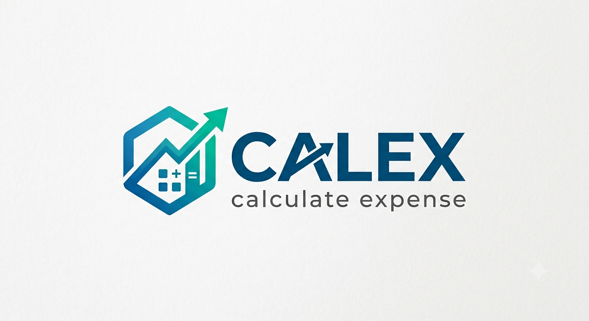

# 💰 Calex – Expense Calculator

<p align="center">
  
</p>

<p align="center">
  <b>AI-Powered Personal Finance Analytics & Expense Management Platform</b>
</p>

<p align="center">
  A modern, multi-user expense tracking application that helps users manage finances, analyze spending patterns, forecast future expenses, and generate insightful financial reports.
</p>

---

## 🚀 Overview

Calex is a production-ready personal finance management platform built using **Flask** and **PostgreSQL**. It enables users to securely manage their income, expenses, and budgets while providing intelligent financial analytics and machine learning-powered predictions.

Unlike traditional expense trackers, Calex focuses on transforming raw financial data into meaningful insights through dynamic visualizations, downloadable reports, and predictive analytics.

---

# ✨ Features

## 👤 User Management

- Secure User Registration
- Login & Logout
- JWT Authentication
- Session Management
- Profile Management
- Multi-user Architecture
- User-specific Dashboards

---

## 💸 Expense Management

- Add Expenses
- Edit Expenses
- Delete Expenses
- Search Expenses
- Category Filters
- Tag Filters
- Pagination
- Expense Attachments
- Payment Method Tracking
- Expense Notes
- Location Tracking

---

## 💰 Income Management

- Add Income
- Edit Income
- Delete Income
- Income History
- Income Categories
- Monthly Income Analysis

---

## 📊 Budget Management

- Monthly Budgets
- Category Budgets
- Budget Utilization
- Remaining Budget
- Budget Monitoring

---

# 📈 Analytics Dashboard

Generate detailed analytics including:

- Expense Trends
- Income Trends
- Category Distribution
- Cash Flow Analysis
- Spending Statistics
- Financial Health Score
- Budget Analysis
- Monthly Summary
- Yearly Summary

---

# 🤖 AI & Machine Learning

Calex includes intelligent financial analytics powered by Scikit-learn.

Features include:

- Expense Forecasting
- Savings Prediction
- Budget Overrun Prediction
- Spending Pattern Analysis
- Financial Health Score
- Anomaly Detection
- Automated Financial Insights

---

# 📑 Reports

Generate downloadable reports in multiple formats.

Supported formats:

- PDF
- CSV
- Excel
- JSON

Reports include:

- Monthly Reports
- Yearly Reports
- Expense Summary
- Financial Statistics
- Spending Insights

---

# 📉 Visualizations

Dynamic charts generated using Matplotlib.

Supported Charts:

- Line Chart
- Bar Chart
- Pie Chart
- Area Chart
- Histogram
- Scatter Plot
- Box Plot
- Heatmap
- Stacked Bar Chart
- Radar Chart

---

# 🔒 Security

- Password Hashing (Werkzeug Scrypt)
- Flask Login Authentication
- JWT Authentication
- Session Protection
- Secure File Uploads
- SQLAlchemy ORM
- Protected Routes

---

# 🏗️ Project Structure

```
Calex/
│
├── app/
│   ├── admin/
│   ├── analytics/
│   ├── auth/
│   ├── budgets/
│   ├── expenses/
│   ├── income/
│   ├── models/
│   ├── templates/
│   ├── static/
│   └── __init__.py
│
├── migrations/
├── requirements.txt
├── config.py
├── run.py
└── README.md
```

---

# 🛠️ Tech Stack

### Frontend

- HTML5
- CSS3
- Bootstrap 5
- JavaScript
- Jinja2

### Backend

- Python
- Flask
- Flask-Login
- Flask-JWT-Extended
- Flask-Mail
- Flask-Migrate
- SQLAlchemy

### Database

- PostgreSQL
- SQLite

### Analytics

- Pandas
- NumPy
- Matplotlib

### Machine Learning

- Scikit-learn
- Prophet

### Development

- Git
- GitHub
- VS Code

---

# 📦 Installation

Clone the repository

```bash
git clone https://github.com/yourusername/calex-expense-calculator.git
```

Move into the project

```bash
cd calex-expense-calculator
```

Create a virtual environment

```bash
python -m venv venv
```

Activate the environment

### Windows

```bash
venv\Scripts\activate
```

### Linux / macOS

```bash
source venv/bin/activate
```

Install dependencies

```bash
pip install -r requirements.txt
```

Run migrations

```bash
flask db upgrade
```

Start the application

```bash
python run.py
```

---

# 📊 Machine Learning Workflow

```
User Expenses
      │
      ▼
Data Cleaning
      │
      ▼
Pandas Processing
      │
      ▼
Feature Engineering
      │
      ▼
Machine Learning
      │
      ▼
Predictions
      │
      ▼
Financial Insights
```

---

# 🎯 Future Enhancements

- Email Verification
- Forgot Password
- Google Login
- GitHub Login
- Dark Mode
- Mobile Responsive Dashboard
- Recurring Transactions
- Investment Tracking
- Goal-Based Savings
- AI Financial Assistant
- OCR Bill Scanner
- Bank API Integration
- Expense Receipt Recognition
- Docker Deployment
- CI/CD Pipeline

---

# 🤝 Contributing

Contributions are welcome!

1. Fork the repository.
2. Create a feature branch.

```bash
git checkout -b feature/new-feature
```

3. Commit your changes.

```bash
git commit -m "Added new feature"
```

4. Push your branch.

```bash
git push origin feature/new-feature
```

5. Open a Pull Request.

---

# 📄 License

This project is licensed under the **MIT License**.

---

# 👨‍💻 Author

**Aswin N**

Artificial Intelligence & Machine Learning Student

GitHub: https://github.com/Aswin-hitech

---

<p align="center">
Made with ❤️ using Flask, PostgreSQL, Machine Learning, and Data Analytics.
</p>
